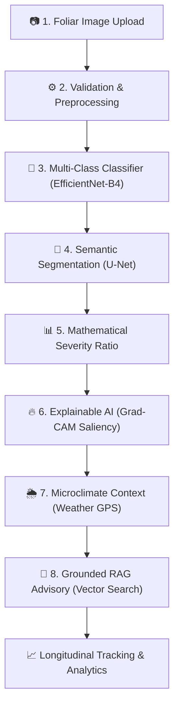

# 🌱 PlantIQ — AI-Powered Plant Health Intelligence & Foliar Disease Detection System

> **“One Image. Multiple Layers of Intelligence.”**  
> *A serious, full-stack college capstone & research platform combining Computer Vision, Deep Learning, Semantic Segmentation, Explainable AI, Unsupervised Clustering, Microclimate Telemetry, and Retrieval-Augmented Generation (RAG).*

---

## 🌟 Executive Overview

**PlantIQ** is not a simple image-to-label wrapper. It is a production-grade agronomic intelligence system that accepts a single foliar photograph and executes an **8-stage synchronized deep learning pipeline**:



---

## 🔬 Core Scientific Principles & Defensibility

1. **Strict Separation of Diagnostic Planes**:
   - **MODEL PREDICTION**: Deterministic Softmax probability distribution from PyTorch convolutional backbones (`EfficientNet-B4` / `ResNet-50`). Uncertainty is reported explicitly; low-confidence images (<60%) trigger rejection rather than artificial certainty.
   - **AI-GENERATED EXPLANATION**: Natural language narrative synthesized strictly via RAG vector search over verified plant pathology documents. The LLM can explain or translate, but **never overwrites** the neural prediction.
   - **ENVIRONMENTAL CONTEXT**: Localized relative humidity, ambient temperature, rainfall, and wind speed retrieved via browser geolocation. Evaluated as **epidemiological risk factors**, never as definitive proof of disease.
2. **Deterministic Lesion Severity**:
   - Severity is computed mathematically from U-Net pixel masks:
     $$\text{Affected Area (\%)} = \left(\frac{\text{Diseased Pixels}}{\text{Total Leaf Pixels}}\right) \times 100$$
   - Categorized into project-defined tiers: **Low** (0–10%), **Moderate** (10–25%), **High** (25–50%), **Critical** (>50%).
3. **Model Interpretability (XAI)**:
   - Grad-CAM heatmap overlays visualize penultimate layer gradients to demonstrate feature attribution without biological causality fallacies.
4. **Unsupervised Morphological Clustering**:
   - K-Means ($K=4$) on 1,792-dimensional latent feature embeddings projected to 2D PCA for anomaly and pattern discovery.

---

## 🛠️ Complete Tech Stack

| Subsystem | Technologies Used |
| :--- | :--- |
| **Frontend** | React 18, Vite 5, Tailwind CSS, Framer Motion, Recharts, Lucide Icons, React Router v6, Axios, Canvas Confetti |
| **Backend** | Python 3.11/3.13, FastAPI (Async), Pydantic v2, JWT (HS256), Uvicorn |
| **Deep Learning & CV**| PyTorch 2.3+, TorchVision, OpenCV (cv2), Pillow, NumPy, Scikit-Learn, Albumentations |
| **Database** | MongoDB (with automatic local in-memory fallback for zero-dependency instant startup) |
| **RAG & GenAI** | Vector similarity retrieval, Markdown pathology corpora, OpenAI / Gemini / Ollama / Demo abstractions |
| **Weather Telemetry** | Geolocation-based OpenWeatherMap / WeatherAPI / Microclimate synthetic engine |
| **DevOps** | Multi-stage Docker, Docker Compose, Nginx, CORS security |

---

## 📁 Repository Structure

```
plantiq/
│
├── frontend/                     # React 18 + Vite + Tailwind Client
│   ├── src/
│   │   ├── components/
│   │   │   ├── auth/             # ProtectedRoute, AdminRoute
│   │   │   ├── common/           # Button, GlassCard, ConfidenceRing, SeverityBadge, ImageUploader, etc.
│   │   │   └── navigation/       # Navbar, Sidebar, MobileBottomNav
│   │   ├── pages/
│   │   │   ├── LandingPage.jsx   # Hero with animated leaf SVG, scan laser, 6-node pipeline
│   │   │   ├── LoginPage.jsx     # 50/50 split authentication with demo quick-fill
│   │   │   ├── RegisterPage.jsx  # Strength meter, language selection, confetti
│   │   │   ├── DashboardPage.jsx # Statistical counters, pathogen pie chart, microclimate
│   │   │   ├── ScanPage.jsx      # Multi-source upload, GPS coordinate lock
│   │   │   ├── AnalysisPage.jsx  # 8-step animated inference pipeline
│   │   │   ├── ScanResultPage.jsx# Vision Studio (Mask, Grad-CAM, Overlay), RAG advisory
│   │   │   ├── HistoryPage.jsx   # Filterable diagnostic records
│   │   │   ├── PlantsPage.jsx    # Monitored crop profiles & new specimen modal
│   │   │   ├── PlantTimelinePage.jsx # Recharts area progression curve & chronology
│   │   │   ├── AnalyticsPage.jsx # Population distributions & environmental correlation
│   │   │   ├── ClustersPage.jsx  # 2D PCA scatter plot (K-Means K=4)
│   │   │   ├── ModelPerformancePage.jsx # Accuracy, Precision, Recall, mIoU, Dice, Confusion Matrix
│   │   │   ├── AssistantPage.jsx # Multilingual RAG chat (English, Hindi, Punjabi)
│   │   │   ├── ProfilePage.jsx   # Identity & role configuration
│   │   │   ├── SettingsPage.jsx  # Runtime provider toggles (AI, Weather, Storage)
│   │   │   └── admin/            # Admin Command Center, Models MLOps, User Registry
│   │   ├── context/              # AuthContext, ToastContext
│   │   ├── services/             # Axios API client & fallback service abstractions
│   │   ├── data/                 # demoData.js (Designated demo benchmark)
│   │   ├── App.jsx               # React Router complete configuration
│   │   └── main.jsx
│   ├── tailwind.config.js        # PlantIQ dark green/purple design system
│   └── package.json
│
├── backend/                      # Python FastAPI Application
│   ├── app/
│   │   ├── main.py               # Application entry, CORS, uploads static mounting
│   │   ├── config.py             # Pydantic environment configuration
│   │   ├── api/                  # Modular route controllers (auth, scan, plants, ai, weather, admin)
│   │   ├── schemas/              # Strict Pydantic input/output contracts
│   │   ├── auth/                 # JWT encoding, hashing, role dependencies
│   │   ├── database/             # MongoDB connection + resilient in-memory fallback
│   │   ├── ml/                   # Classifier, Segmenter, Severity, Grad-CAM, Clustering
│   │   ├── weather/              # WeatherProvider abstraction (OpenWeather, Demo)
│   │   ├── ai/                   # AIProvider abstraction (OpenAI, Gemini, Ollama, Demo)
│   │   └── services/             # rag.py (DocumentLoader, vector similarity retriever)
│   ├── tests/                    # Automated API test suite
│   ├── uploads/                  # Storage for uploaded foliage, masks, and heatmaps
│   └── requirements.txt
│
├── ml/                           # Standalone Deep Learning Training Pipelines
│   ├── training/                 # train_classifier.py (EfficientNet transfer learning)
│   ├── segmentation/             # train_unet.py (U-Net lesion mask segmentation)
│   ├── explainability/           # gradcam_generator.py (Penultimate layer gradients)
│   ├── clustering/               # kmeans_embeddings.py (1792-D feature vector clustering)
│   ├── evaluation/               # metrics.py (Confusion matrix, mIoU, Dice score)
│   └── inference/                # smoke_test.py (Subsystem acceptance verification)
│
├── knowledge_base/               # Curated Pathology RAG Documents
│   ├── diseases/                 # late_blight.md, early_blight.md, etc.
│   ├── symptoms/                 # foliar_symptoms.md
│   ├── prevention/               # cultural_controls.md
│   └── management/               # fungicide_guide.md
│
├── docker-compose.yml            # Full-stack container orchestration
├── .env.example                  # Environment variable reference
└── README.md
```

---

## ⚡ Quick Start Guide

### 1. Prerequisites
- **Node.js**: v18+ (tested on v24)
- **Python**: 3.10+ (tested on 3.13)
- **Docker** *(Optional)*: For containerized deployment

---

### 2. Running Locally (Development Mode)

#### A. Backend Setup
```bash
cd plantiq/backend

# Create virtual environment (optional)
python -m venv venv
# Windows:
venv\Scripts\activate
# Linux/macOS:
source venv/bin/activate

# Install dependencies
pip install -r requirements.txt

# Start FastAPI server
python -m uvicorn app.main:app --host 127.0.0.1 --port 8000 --reload
```
*The backend API documentation is now live at: `http://127.0.0.1:8000/docs`*

#### B. Frontend Setup
```bash
cd plantiq/frontend

# Install dependencies
npm install

# Start Vite dev server
npm run dev
```
*The web portal is now accessible at: `http://localhost:5173`*

---

### 3. Docker Deployment (Single Command)

To launch the full stack (Frontend + Backend + MongoDB) inside isolated containers:
```bash
cd plantiq
docker-compose up --build
```
- Web Application: `http://localhost:5173`
- API Swagger Docs: `http://localhost:8000/docs`
- MongoDB Port: `27017`

---

## 🧪 Automated Testing & Verification

PlantIQ includes comprehensive unit, integration, and ML smoke test suites:

```bash
# 1. Run ML Pipeline Smoke Test (Validates Classifier, Severity, Clustering)
python plantiq/ml/inference/smoke_test.py

# 2. Run Backend API Acceptance Tests (Validates Auth, Uploads, Weather, RAG, Analytics)
python plantiq/backend/tests/test_api.py

# 3. Test Production Frontend Build
cd plantiq/frontend && npm run build
```

---

## 🔑 Demo Access Credentials

The application provides instant demo credentials right on the login page:

| Role | Email | Password | Access Privileges |
| :--- | :--- | :--- | :--- |
| **Administrator** | `admin@plantiq.ai` | `admin1234` | Full user management, MLOps validation & model deployment |
| **Farmer / User** | `farmer.demo@plantiq.ai` | `farmer1234` | Foliar scanning, crop timelines, chat assistant, analytics |

*In development mode, `DEMO_MODE=true` ensures the platform operates completely offline without requiring cloud API keys.*

---

## 🌐 API Route Specifications

| Method | Endpoint | Description |
| :--- | :--- | :--- |
| `POST` | `/api/auth/register` | Registers new user account with hashed password |
| `POST` | `/api/auth/login` | Issues JWT bearer token |
| `GET` | `/api/auth/me` | Validates session and returns current user details |
| `POST` | `/api/scan` | Multipart file upload running the 8-layer deep learning pipeline |
| `GET` | `/api/scan/{id}` | Fetches detailed scan report, U-Net mask, and Grad-CAM URL |
| `GET` | `/api/scan/{id}/status`| Real-time inference progress polling |
| `GET` | `/api/scans` | Historical scan repository with category filtering |
| `GET` | `/api/dashboard` | Aggregated statistical counters and microclimate summary |
| `GET` | `/api/plants` | CRUD operations for monitored crop units |
| `GET` | `/api/plants/{id}/timeline`| Multi-scan progression timeline nodes |
| `GET` | `/api/analytics` | Population-level pathogen distribution & correlation data |
| `GET` | `/api/clusters` | 2D PCA projection of K-Means feature clusters |
| `POST` | `/api/ai/chat` | RAG-grounded multilingual agronomic assistant |
| `GET` | `/api/weather` | Synchronized microclimate environmental telemetry |
| `GET` | `/api/models/performance`| Benchmark metrics (Accuracy, IoU, Dice, Confusion Matrix) |
| `POST` | `/api/admin/models/{id}/deploy`| Promotes validated model architecture to production |

---

## 📜 Academic Defense Summary (Viva Notes)

When presenting this project for technical evaluation:
1. **Explain the Pipeline Synergy**: Explain that classification identifies the disease family, segmentation calculates the damaged leaf percentage, Grad-CAM verifies model spatial focus, and weather contextualizes environmental risk.
2. **Defend the RAG Architecture**: Emphasize that the LLM is strictly used for natural language explanation and is grounded in local Markdown pathology textbooks, completely preventing LLM hallucination of false disease predictions.
3. **Address Uncertainty**: Show that low-confidence scans (<60%) trigger rejection warnings rather than making dangerous agricultural guesses.
4. **Showcase Longitudinal Tracking**: Demonstrate how serial scans of the same crop unit generate an area progression curve to assess recovery over time.

---

**PlantIQ** — *Engineered with precision for farmers, researchers, and sustainable agriculture.*
